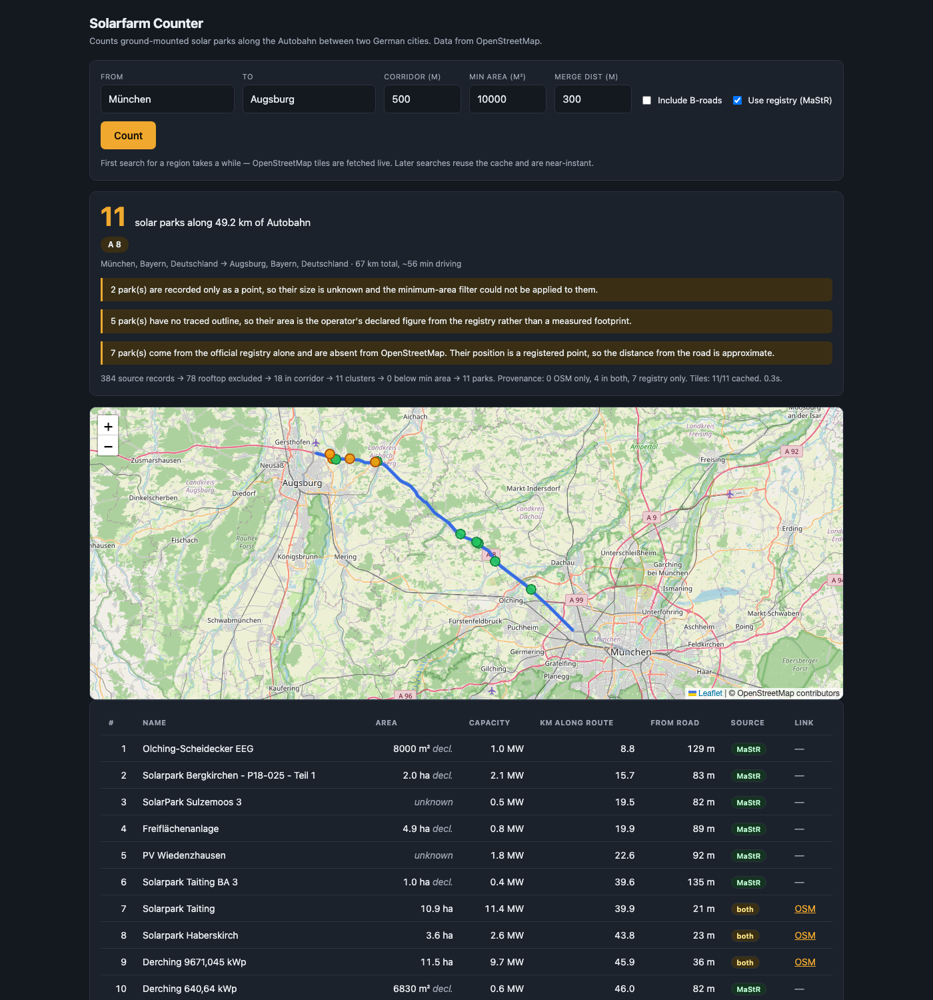

# Solarfarm Counter

Counts ground-mounted solar parks along the Autobahn between two German cities.

```
München → Nürnberg
35 solar parks along 156.1 km of Autobahn (A 9, A 73)
```



Requires Python 3.10+.

No AI involved, and none needed — this is a deterministic geospatial problem. Route geometry
comes from OSRM, solar features from OpenStreetMap, and the rest is arithmetic. An LLM would
only add latency, cost, and answers that change between runs.

## Quick start

```bash
pip install -r requirements.txt
uvicorn app.main:app --reload
```

Then open <http://127.0.0.1:8000>.

The first search across a region fetches OpenStreetMap data live and takes a minute or two.
Everything after that is served from a local SQLite cache in well under a second.

### Optional but strongly recommended: add the official registry

OpenStreetMap alone **misses real solar parks** — it only contains what a volunteer has
traced, and commercial parks are often never drawn. The two ANUMAR fields on the A 8 at
Bergkirchen are plainly visible on satellite imagery and have no OSM presence at all.

The [Marktstammdatenregister](https://www.marktstammdatenregister.de/) (MaStR) is the
Bundesnetzagentur's register of every generating unit in Germany. Registration is legally
mandatory, so it covers what OSM misses:

```bash
# ~3 GB one-time download from marktstammdatenregister.de/MaStR/Datendownload
python scripts/build_mastr.py ~/Downloads/Gesamtdatenexport_*.zip
```

That distils the archive into `data/mastr_solar.sqlite3` (a few MB); the archive can then be
deleted. Without it the app still works, but says so in a warning on every search.

## How it works

1. **Geocode** both cities with Nominatim.
2. **Route** between them with OSRM, requesting per-step detail.
3. **Isolate the Autobahn.** OSRM tags every step with its road reference (`A 9`, `A 73`), so
   the motorway portions are extracted exactly — no map matching or guesswork. On the München →
   Nürnberg route this is 156.1 km of the 170.6 km trip; the city streets at either end are
   dropped.
4. **Fetch solar features** from Overpass, tile by tile, and from the local MaStR extract.
5. **Filter and cluster** both sources together into distinct parks.

### Why the raw record count is not the answer

OpenStreetMap maps a single large solar park as anything from one tagged polygon to dozens of
separate panel-row ways, and it maps a great deal of rooftop PV that is not a park at all.
On München → Nürnberg, with both sources:

| stage | count |
| --- | --- |
| raw source records in the scanned tiles | 975 |
| after excluding rooftop PV | 547 |
| after keeping only what is within 500 m of the Autobahn | 136 |
| after merging features within 300 m of each other | 48 |
| after dropping clusters under 10,000 m², and points nothing corroborates | **35** |

Every one of those steps is reported in the API response under `stats`, so the headline number
is always traceable back to the raw data.

The registry matters more than any threshold: the same route yields **20 parks from OSM alone**
and **35 with the registry added**.

### Definitions you can change

| Parameter | Default | Meaning |
| --- | --- | --- |
| `corridor_m` | 500 | Max distance from the motorway centerline |
| `link_m` | 300 | Features closer than this merge into one park |
| `min_area_m2` | 10000 | Clusters smaller than this are not counted |
| `include_bundesstrasse` | false | Also scan B-roads, for routes with no Autobahn |
| `use_mastr` | true | Also use the official registry, not just OpenStreetMap |
| `require_corroboration` | true | Drop OSM points with no area that no registry entry backs |
| `exclude_on_buildings` | false | Additionally cross-check candidates against building outlines |

These genuinely move the answer, which is why they are exposed rather than hard-coded
(München → Nürnberg, both sources):

```
min_area_m2   0 → 46 parks      corridor_m   200 → 31 parks
           5000 → 41 parks                   500 → 35 parks
          10000 → 35 parks                  1000 → 44 parks
          20000 → 31 parks
```

Parks whose size is unknown — registry units that declare no land area — cannot be size-filtered
and are always kept, flagged in the response rather than silently dropped or counted as zero.

### Rooftop arrays that carry no rooftop tag

The tag test only catches arrays somebody remembered to tag. `node/13155920665` on the A 8 is a
bare `power=generator` + `generator:source=solar` point: no `location=roof`, and no area for the
size filter to bite on. It sits one metre inside a `building=farm_auxiliary` — PV on a barn roof,
counted as a solar park.

`require_corroboration` closes that gap for free. A ground-mount park in Germany must by law be
registered, and a real one is almost always traced as a polygon, so an OSM point with **neither an
area nor a registry entry** is weak evidence and is left out. Every exclusion is counted in
`stats.uncorroborated_points` and reported as a warning, and the rule can be switched off.

`exclude_on_buildings` is the thorough version: it fetches building outlines and drops any
candidate sitting on one. It is off by default because it costs an extra Overpass request per 20
candidates, which is slow and unkind to a free service.

## API

```
GET /api/search?from=München&to=Nürnberg
GET /api/search?from=Hamburg&to=Berlin&corridor_m=1000&min_area_m2=20000
GET /api/health
```

There is also `GET /api/search/stream`, the same search as server-sent events. It emits `progress`
events (`geocoding`, `routing`, `tiles` with done/total, `analysing`) and then a single `result` or
`error`. The UI uses it, so a cold search shows "Map data 7/23…" rather than a spinner that looks
identical to a hung request.

Interactive docs at `/docs`. The UI mirrors its state into the URL, so any search can be
bookmarked or shared.

## Two sources, one count

Each park records where it came from, shown as a chip in the table and a colour on the map:

| Chip | Meaning |
| --- | --- |
| `OSM` | Traced outline in OpenStreetMap — area is **measured** from the polygon |
| `MaStR` | Registry only — position is a registered point, area is the operator's **declared** figure |
| `both` | Found in each source, counted once |

Both sources are fed through a **single clustering pass**, which is what prevents double
counting: a park that is traced in OSM *and* registered in MaStR merges into one park whose
provenance lists both. Where the two disagree on size, the measured geometry wins — a declared
figure is never added to a measured one.

Registry-only parks are the honest weak spot: MaStR gives one coordinate per registered unit,
not an outline, and that point can sit some way off the actual array. They are marked rather
than blended in, so you can always tell which numbers rest on traced geometry.

## Design notes

**Distance is measured from a park's nearest edge, not its centre.** A 12-hectare park whose
boundary runs 50 m from the carriageway is plainly next to the Autobahn even when its centroid
sits 600 m away.

**Disjoint motorway runs are kept as separate polylines.** Concatenating them would create a
phantom straight segment across the gap between them and drag unrelated features into the
corridor.

**Overpass tiles use a fixed 0.1° grid**, not route-shaped bounding boxes, so tiles are shared
between routes — München → Nürnberg and München → Berlin reuse the same A 9 tiles. An early
prototype using route-shaped boxes took 215 s and was repeatedly rate-limited.

**Motorway detection falls back to signage when OSRM omits `ref`.** OSRM usually labels each step
with its road reference, which makes extraction exact. Sometimes it does not: Stuttgart → Karlsruhe
returns the entire 60.5 km A 8 as one step with no `ref` at all, which cut the scanned distance to
3.7 km of an 80 km trip. Where `ref` is missing, the step's `destinations` signage is used instead —
but only when the step is over 2 km and averages 80 km/h or more, so a slip road signed for the A 3
is not mistaken for the A 3 itself. That route now scans 64.2 km.

**Cold searches are bounded by mirror latency, not bandwidth.** Tile payloads are tiny (median
4 KB), so the cost is entirely how long a mirror takes to answer. Measured cold, with an empty
cache: München → Nürnberg (23 tiles) takes ~45 s and Stuttgart → Karlsruhe (10 tiles) ~43 s. Both
were 180 s and 90 s before mirror selection was made health-aware.

**Mirrors are chosen by measured health, not by list order.** Public Overpass instances vary wildly
and unpredictably: within one minute, overpass-api.de refused connections outright while
kumi.systems answered real tile queries in 38–176 s. Each mirror's recent latency and failures are
tracked; requests go to whichever is actually working, and a mirror that stalls for 12 s is hedged —
a second request goes out alongside it and the first reply wins.

Concurrent tiles are spread across mirrors, but only across mirrors of *comparable* speed. Blind
rotation is worse than none when one mirror is far faster: most tiles start on a slow one and pay
the full hedge delay first, which is exactly what made a ~45 s search take 180 s.

Run `python scripts/check_mirrors.py` to verify a mirror before adding it. It tests for known German
data rather than merely that the server answers.

**Overpass mirrors must have global coverage.** A regional instance answers an out-of-area
query with HTTP 200 and zero elements — indistinguishable from "no solar farms here", and it gets
cached as fact. `overpass.osm.ch` was briefly in the fallback list and does exactly that: Zurich
returns 18,577 buildings, Munich returns 0. Each cached tile now records the mirror that served
it, so an empty tile is attributable rather than anonymous.

**Failures are reported, never hidden.** If a tile cannot be fetched after retries across three
mirrors, the response still returns, with a warning that the count is a lower bound. Parks
mapped only as points have no measurable area; they are returned with `area_m2: null` and
flagged, rather than being silently dropped by the size filter or counted as zero.

## Tests

```bash
pytest
```

114 tests, fully offline — they run against recorded OSRM and Overpass fixtures in
`tests/fixtures/`, including regression checks pinning the real München → Nürnberg counts.
CI runs them on Python 3.10 through 3.13.

## Licence

Code is MIT (see `LICENSE`). **The data is licensed separately** — OpenStreetMap under ODbL and
the Marktstammdatenregister under dl-de/by-2-0, both of which require attribution. If you deploy
this publicly those obligations are yours; `ATTRIBUTION.md` sets out what each one needs.

## Limitations

- Coverage depends on OpenStreetMap. A park nobody has mapped cannot be counted, and the
  rooftop/ground distinction relies on how diligently each feature was tagged.
- Germany only (geocoding is country-restricted).
- Capacity in MW is reported only for parks present in the registry; OSM's
  `generator:output:electricity` is too sparsely tagged to rely on.
- Registry positions are single registered points, not outlines, so their distance from the road
  is approximate and they carry declared rather than measured areas. Both facts are flagged per
  park and in the response warnings.
- Uses public demo servers for routing and Overpass. Fine for personal use; a deployment with
  real traffic should self-host or use a commercial endpoint. Every endpoint is settable by
  environment variable — see `ATTRIBUTION.md`.
- A search is capped at 5 minutes (`SOLARFARM_SEARCH_TIMEOUT`). On expiry it returns what it has
  and flags the count as a lower bound; already-fetched areas stay cached, so re-running resumes.
- Single-user by design. There is no rate limiting, no auth, and the SQLite caches assume one
  process — do not expose it to the open internet as-is.
